# SwiftNetworkPro System Architecture

Visual representation of SwiftNetworkPro's enterprise-grade architecture and component interactions.

## 🏗️ High-Level Architecture Overview

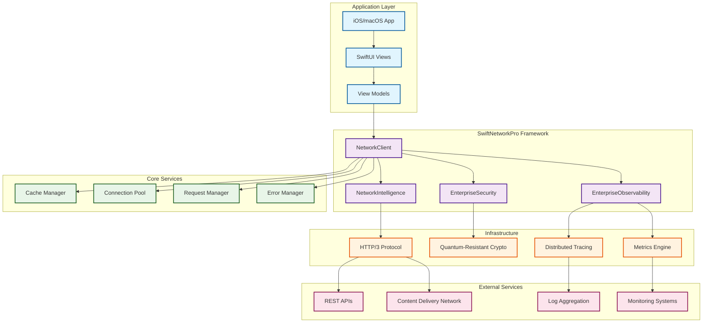

## 🔄 Request Lifecycle Flow

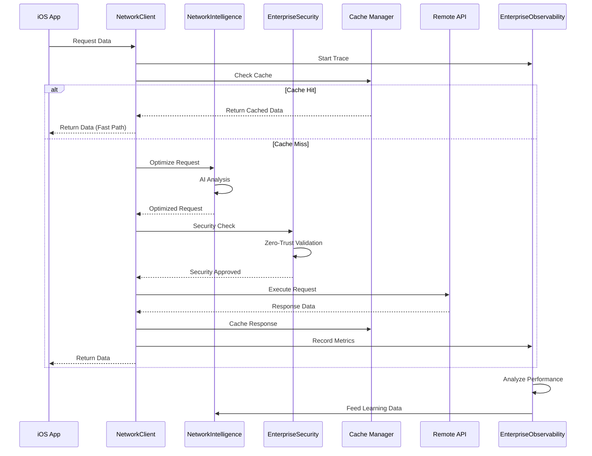

## 🧠 AI-Powered Network Intelligence

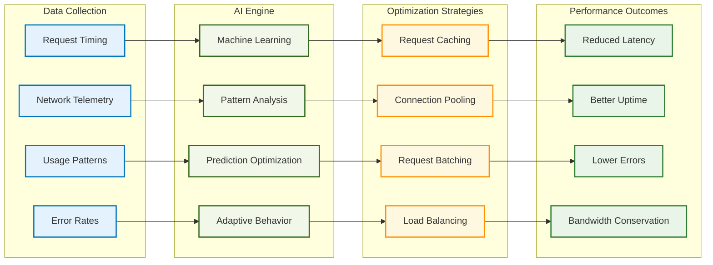

## 🔐 Zero-Trust Security Architecture

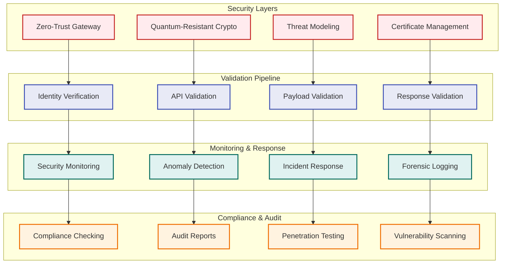

## 📊 Enterprise Observability Stack

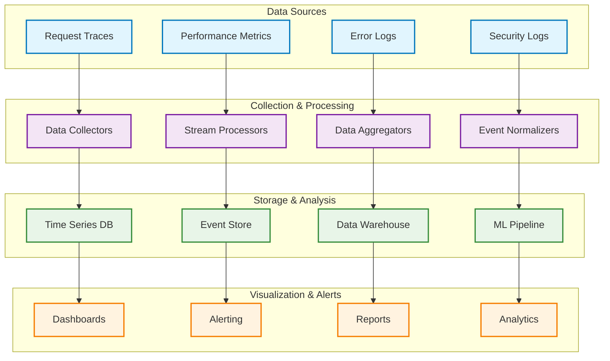

## ⚡ Performance Optimization Pipeline

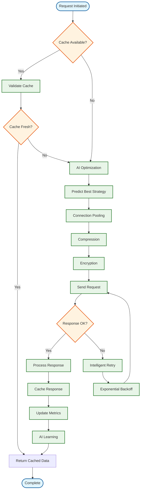

## 🏢 Enterprise Integration Architecture

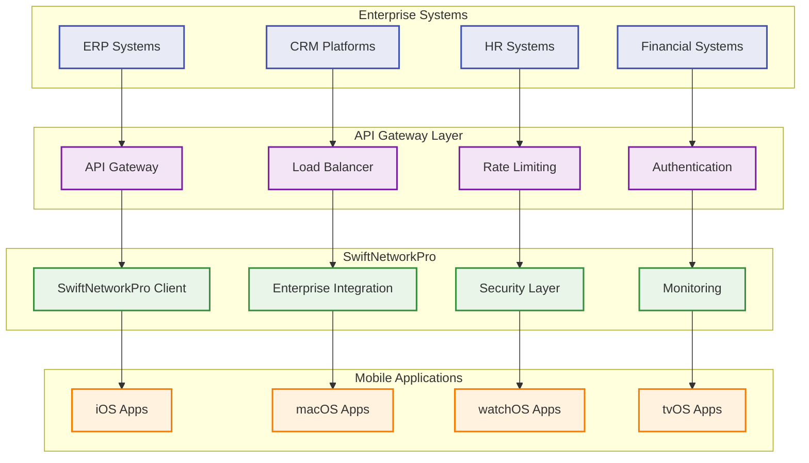

## 🔄 Caching Strategy Flow

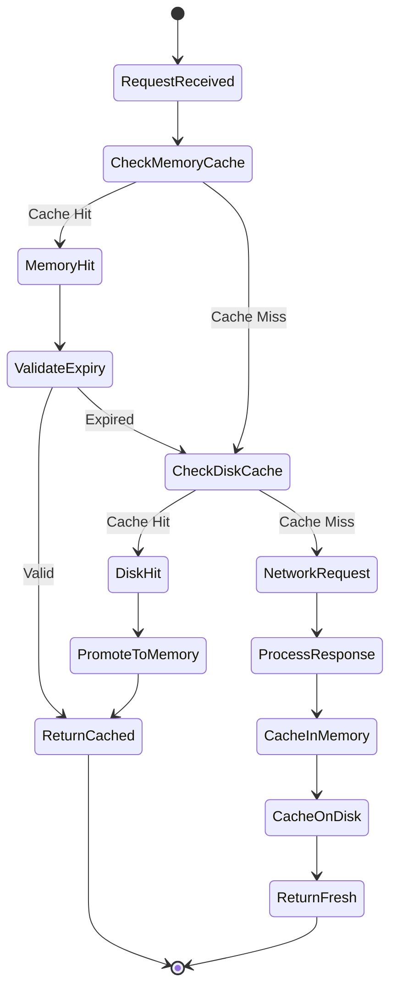

## 🌊 Data Flow Architecture

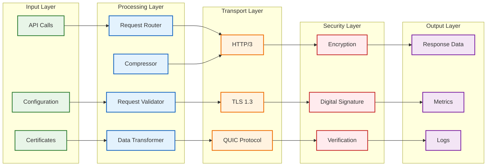

## 🎯 Performance Metrics Dashboard

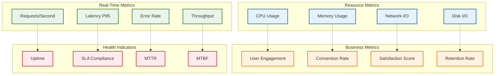

## 🔧 Component Interaction Map

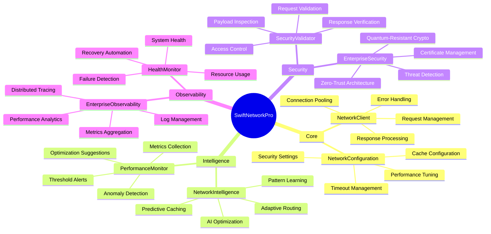

## 📚 Integration Patterns

### Dependency Injection Pattern
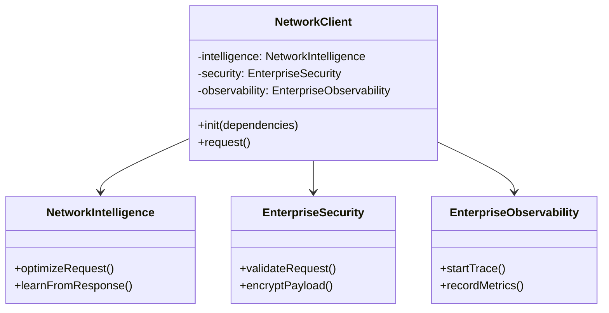

### Observer Pattern for Metrics
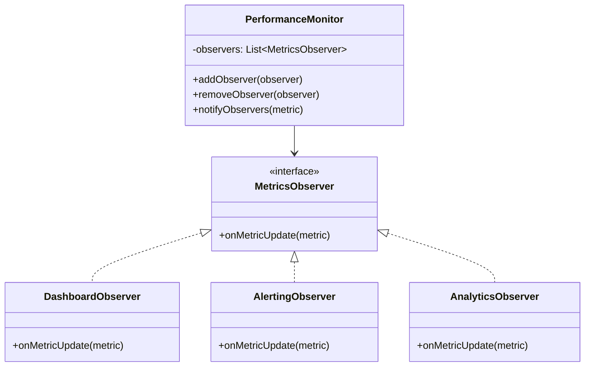

## 🚀 Deployment Architecture

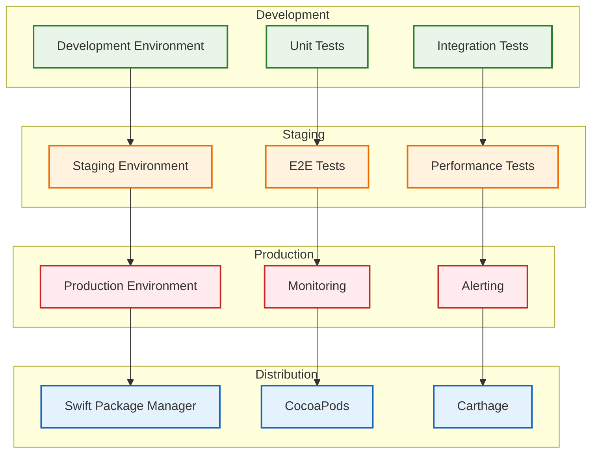

---

## 🎨 Visual Design Guidelines

### Color Coding
- **🟢 Green**: Core framework components and successful states
- **🔵 Blue**: Processing and data flow operations
- **🟠 Orange**: Infrastructure and transport layers
- **🔴 Red**: Security and monitoring components
- **🟣 Purple**: AI and intelligence features

### Symbol Legend
- **Rectangles**: System components and services
- **Diamonds**: Decision points and validation steps
- **Circles**: Start/end points and events
- **Arrows**: Data flow and dependencies
- **Dashed Lines**: Optional or conditional flows

### Architecture Principles
1. **Layered Architecture**: Clear separation of concerns
2. **Dependency Injection**: Loose coupling between components
3. **Observer Pattern**: Event-driven architecture
4. **Strategy Pattern**: Pluggable algorithms and policies
5. **Facade Pattern**: Simplified interfaces for complex subsystems

---

## See Also

- [NetworkClient API Reference](../API/NetworkClient.md)
- [Enterprise Features Guide](../Enterprise.md)
- [Performance Optimization](../Performance/Optimization.md)
- [Security Architecture](../Security/Architecture.md)
- [Integration Guide](../Integration.md)