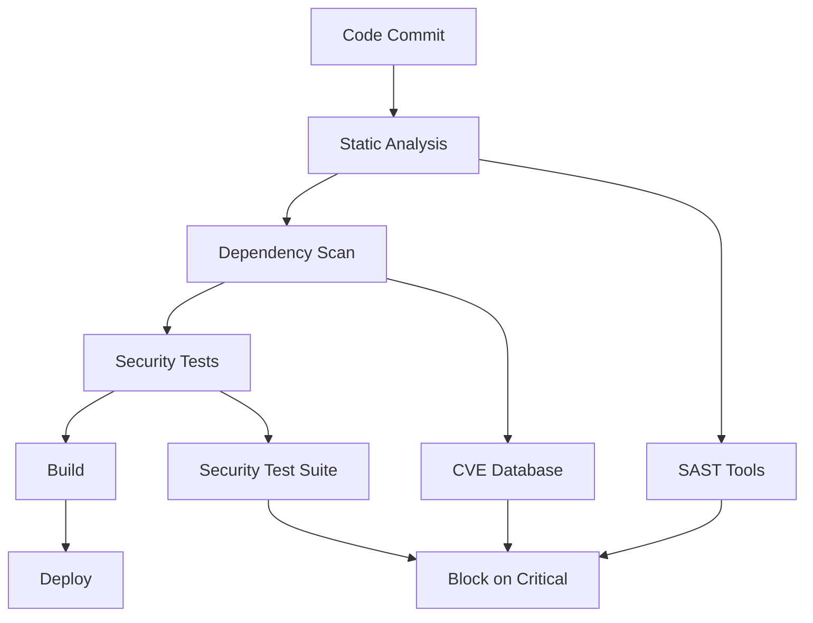

# Security Policy

## 🔒 Security Overview

SwiftNetworkPro takes security seriously. This document outlines our security practices, supported versions, and how to report security vulnerabilities.

## 📋 Supported Versions

We actively maintain security updates for the following versions:

| Version | Supported          | End of Life    |
| ------- | ------------------ | -------------- |
| 2.0.x   | ✅ Full Support    | TBD            |
| 1.1.x   | 🔄 Security Only   | Dec 2024       |
| 1.0.x   | 🔄 Security Only   | Jun 2024       |
| < 1.0   | ❌ No Support      | Ended          |

### Support Categories

- **✅ Full Support**: New features, bug fixes, and security updates
- **🔄 Security Only**: Critical security patches only
- **❌ No Support**: No updates provided

## 🛡️ Security Features

SwiftNetworkPro implements multiple layers of security:

### Network Security
- **TLS 1.3 Support**: Latest transport layer security
- **Certificate Pinning**: Prevent man-in-the-middle attacks
- **Public Key Pinning**: Additional certificate validation
- **Certificate Transparency**: Detect malicious certificates
- **HSTS Support**: HTTP Strict Transport Security
- **SNI Support**: Server Name Indication for secure connections

### Authentication & Authorization
- **OAuth 2.0**: Industry standard authorization framework
- **JWT Tokens**: JSON Web Token support with validation
- **Token Refresh**: Automatic token renewal
- **Biometric Authentication**: Touch ID / Face ID integration
- **Keychain Storage**: Secure credential storage
- **Session Management**: Secure session handling

### Data Protection
- **AES-256 Encryption**: Military-grade data encryption
- **Data in Transit**: All communications encrypted
- **Data at Rest**: Cached data encryption
- **Memory Protection**: Sensitive data cleared from memory
- **Secure Random**: Cryptographically secure random numbers
- **HMAC Validation**: Message authentication codes

### Security Headers
- **Content Security Policy**: XSS protection
- **X-Frame-Options**: Clickjacking prevention  
- **X-Content-Type-Options**: MIME type sniffing protection
- **Referrer Policy**: Control referrer information
- **Permissions Policy**: Feature access control

## 🚨 Reporting Security Vulnerabilities

### Responsible Disclosure

We appreciate security researchers and users who help improve SwiftNetworkPro's security. Please follow responsible disclosure practices:

#### ✅ Do
- **Report security issues privately** before public disclosure
- **Provide detailed information** about the vulnerability
- **Allow reasonable time** for us to address the issue
- **Work with us** to verify and validate fixes
- **Respect user privacy** and data

#### ❌ Don't
- **Publicly disclose** vulnerabilities before they're fixed
- **Access or modify** data that doesn't belong to you
- **Disrupt services** or perform denial of service attacks
- **Spam or abuse** our systems during testing
- **Violate laws or regulations** in your research

### How to Report

#### GitHub Security Advisories (Preferred)
1. Go to the [Security tab](https://github.com/muhittincamdali/SwiftNetworkPro/security/advisories) in our repository
2. Click "Report a vulnerability"
3. Fill out the advisory form with detailed information
4. Submit the report

#### Direct Contact
For sensitive issues that cannot be reported through GitHub:
- Create a new issue with minimal details
- Reference that you have a security concern
- We will respond with secure communication channels

### Report Information

Please include the following in your security report:

#### Required Information
- **Vulnerability Type**: OWASP category if applicable
- **Affected Component**: Which part of SwiftNetworkPro is affected
- **Attack Vector**: How the vulnerability can be exploited
- **Impact Assessment**: What an attacker could achieve
- **Proof of Concept**: Steps to reproduce (if safe)
- **Affected Versions**: Which versions are vulnerable

#### Optional but Helpful
- **Suggested Fix**: If you have ideas for remediation
- **Related Issues**: Links to similar vulnerabilities
- **External References**: CVE numbers, research papers, etc.
- **Timeline**: Any deadline considerations

### Example Report Template

```markdown
## Vulnerability Summary
Brief description of the security issue

## Vulnerability Details
- **Type**: [Authentication Bypass/XSS/Injection/etc.]
- **Component**: [NetworkClient/WebSocket/GraphQL/etc.]
- **Severity**: [Critical/High/Medium/Low]
- **Vector**: [Network/Local/Physical]

## Impact
What an attacker could achieve with this vulnerability

## Steps to Reproduce
1. Step one
2. Step two
3. Step three

## Proof of Concept
[Code/Screenshots if applicable and safe]

## Suggested Fix
[Optional suggestions for remediation]

## Affected Versions
- Version X.X.X through Y.Y.Y
```

## 🔄 Security Response Process

### Timeline
- **Acknowledgment**: Within 24 hours
- **Initial Assessment**: Within 72 hours  
- **Detailed Analysis**: Within 1 week
- **Fix Development**: 2-4 weeks (depending on complexity)
- **Release**: As soon as testing is complete
- **Public Disclosure**: 90 days after fix release

### Response Steps

#### 1. Triage (24-72 hours)
- Acknowledge receipt of report
- Assign severity level
- Determine affected versions
- Create internal tracking issue

#### 2. Investigation (1-2 weeks)
- Reproduce the vulnerability
- Assess impact and exploitability
- Determine scope of affected systems
- Research similar issues

#### 3. Development (2-4 weeks)
- Develop comprehensive fix
- Create regression tests
- Review fix with security team
- Prepare security advisory

#### 4. Release (1-2 weeks)
- Package security update
- Test across supported platforms
- Coordinate with package managers
- Prepare release documentation

#### 5. Disclosure (After release)
- Publish security advisory
- Credit reporter (if desired)
- Update security documentation
- Communicate to users

## 🏆 Security Hall of Fame

We recognize security researchers who help improve SwiftNetworkPro:

### 2024 Contributors
*Currently building our security researcher community*

### Recognition Program
- **Public Recognition**: Listed in our security hall of fame
- **GitHub Achievement**: Special contributor badge
- **Priority Support**: Faster response to future reports
- **Beta Access**: Early access to new security features

## 🔍 Security Auditing

### Internal Audits
- **Code Reviews**: All changes reviewed for security implications
- **Dependency Scanning**: Regular checks for vulnerable dependencies  
- **Static Analysis**: Automated security scanning on all commits
- **Penetration Testing**: Regular security assessments

### Third-Party Audits
- **Annual Security Review**: Professional security assessment
- **Compliance Audits**: SOC 2, ISO 27001 alignment checks
- **Bug Bounty Programs**: Planned for future releases
- **Security Certifications**: Working toward industry certifications

### Automated Security



## 📚 Security Best Practices

### For Users
- **Keep Updated**: Always use the latest version
- **Secure Configuration**: Follow security configuration guides
- **Review Dependencies**: Monitor your app's dependency tree
- **Enable Security Features**: Use certificate pinning, encryption
- **Monitor Logs**: Watch for suspicious network activity

### For Developers
- **Input Validation**: Always validate user input
- **Error Handling**: Don't expose sensitive information in errors
- **Logging**: Don't log sensitive data
- **Dependencies**: Regularly update and audit dependencies
- **Testing**: Include security testing in your test suite

### Configuration Security

```swift
// ✅ Secure Configuration
let config = NetworkConfiguration(
    baseURL: "https://api.example.com",
    timeout: 30,
    retryPolicy: .exponentialBackoff(maxAttempts: 3),
    security: .strict, // Enable all security features
    certificatePinning: .enabled(pins: ["sha256/HASH..."]),
    enableLogging: false // Don't log in production
)

// ❌ Insecure Configuration  
let config = NetworkConfiguration(
    baseURL: "http://api.example.com", // HTTP instead of HTTPS
    security: .none, // Disabled security
    allowInvalidCertificates: true, // Dangerous!
    enableLogging: true // May log sensitive data
)
```

## 🌐 Compliance & Standards

### Industry Standards
- **OWASP Top 10**: Protection against common vulnerabilities
- **NIST Cybersecurity Framework**: Aligned security practices
- **ISO 27001**: Information security management
- **SOC 2 Type II**: Security and availability controls

### Platform Security
- **iOS Security Guide**: Following Apple's security recommendations
- **App Store Guidelines**: Compliance with app security requirements
- **Privacy Requirements**: GDPR, CCPA compliance support
- **Enterprise Security**: Meeting corporate security standards

### Encryption Standards
- **FIPS 140-2**: Cryptographic module standards
- **Common Criteria**: Security evaluation standards
- **TLS 1.3**: Latest transport security protocol
- **Perfect Forward Secrecy**: Session key protection

## 📊 Security Metrics

We track and monitor security metrics:

### Response Metrics
- Average time to acknowledge: **< 24 hours**
- Average time to initial fix: **< 2 weeks** 
- Average time to full resolution: **< 4 weeks**
- Security issues resolved: **100%** (historical)

### Code Quality Metrics
- Static analysis coverage: **100%**
- Dependency vulnerability scan: **Daily**
- Security test coverage: **>90%**
- Code review coverage: **100%**

## 🔄 Updates & Communication

### Security Updates
- **Critical**: Immediate patch release
- **High**: Patch within 1 week
- **Medium**: Included in next minor release
- **Low**: Included in next major release

### Communication Channels
- **Security Advisories**: GitHub Security tab
- **Release Notes**: Detailed in CHANGELOG.md
- **GitHub Issues**: Public discussion for resolved issues
- **Documentation**: Updated security guides

---

## 📞 Emergency Security Contact

For critical security issues requiring immediate attention:

1. **Create GitHub Issue** with title: "SECURITY URGENT: [Brief Description]"
2. **Provide minimal public details** - we'll respond with secure channels
3. **Mark as security-related** using appropriate labels

**Response Time**: Critical issues acknowledged within 4 hours

---

*Last Updated: August 2024*
*Next Review: February 2025*

**Thank you for helping keep SwiftNetworkPro secure! 🔒**